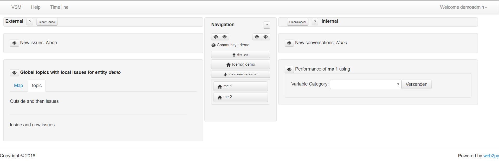

# openvsm
Implementation of VSM organisation modelling in Python

The application can be installed and executed as follows:
1. Install web2py for Windows or Mac users http://web2py.com/init/default/download
2. Download the openvsm.w2p file (and remenber where it lands)
3. Run web2py
4. Install then openvsm app by importing and using the openvsm.w2p file
5. Execute the openvsm app

The opening screen of OpenVSM looks like the following

